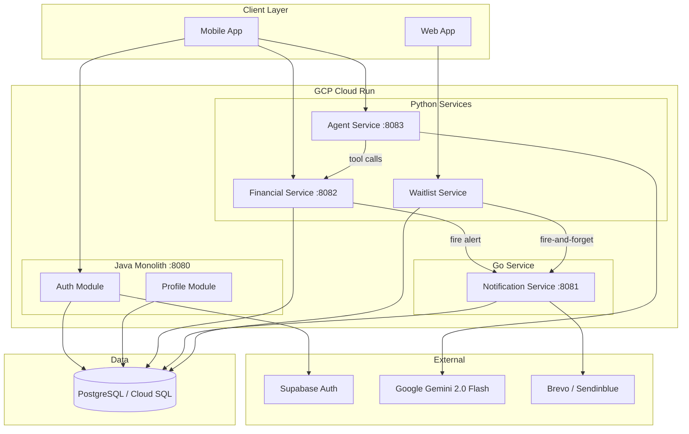

# 🏦 MoneyLane

**The Proactive Financial Co-pilot.** MoneyLane transforms traditional expense tracking (reactive) into AI-driven guidance (proactive) using real-time interventions, loss-framed predictions, and automated behavior-change loops.

[](https://api.moneylane.elevenxstudios.com)
[](https://www.oracle.com/java/technologies/downloads/#java21)
[](https://www.python.org/)
[](https://go.dev/)

---

## 📋 Table of Contents

- [✨ Features at a Glance](#-features-at-a-glance)
- [🏗️ Architecture Overview](#️-architecture-overview)
- [🔧 Tech Stack](#-tech-stack)
- [📂 Project Structure](#-project-structure)
- [🧩 Services & Modules](#-services--modules)
- [📐 High-Level Design](#-high-level-design)
- [📏 Low-Level Design](#-low-level-design)
- [🚀 Getting Started](#-getting-started)
- [📡 API Reference](#-api-reference)
- [🗄️ Database Migrations](#️-database-migrations)
- [🧪 Testing](#-testing)
- [⚙️ CI/CD](#️-cicd)
- [☁️ Cloud Infrastructure](#️-cloud-infrastructure)
- [🛠️ Development Workflow](#️-development-workflow)
- [📚 Documentation](#-documentation)

---

## ✨ Features at a Glance

- **Proactive Interventions**: 3-check pipeline (Soft-block → Daily Limit → Predictive Warning).
- **AI Co-pilot**: Gemini-powered conversational agent for autonomous actions.
- **Loss-Framed Insights**: "You'll WASTE ₹2,400" vs "You'll overspend ₹2,400".
- **Multi-Auth**: Native JWT + Supabase integration.
- **Exactly-Once Notifications**: High-performance Go service for transactional emails.
- **Microservice-Ready**: Modular monolith transitionable to full microservices.

---

## 🏗️ Architecture Overview

The system uses a **polyglot monorepo** approach, balancing the robustness of Java for core identity with the rapid iteration of Python for AI/Financial logic and Go for high-performance delivery.

### System Topology



| Service | Tech | Role | Port |
|---------|------|------|------|
| **Java Monolith** | Java 21 / Spring Boot | Identity (Auth + Supabase) & Profile management | 8080 |
| **Financial Service** | Python / FastAPI / SQLModel | Core data engine: transactions, budgets, insight engine, **intervention engine**, predictions | 8082 |
| **Agent Service** | Python / FastAPI / Gemini | AI co-pilot: conversational interface with tool-calling for autonomous actions | 8083 |
| **Notification Service** | Go / net/http / Brevo | Exactly-once transactional email delivery with idempotency | 8081 |
| **Waitlist Service** | Python / FastAPI / SQLAlchemy | Pre-launch email collection | — |

---

## 🔧 Tech Stack

- **Backend**: Java 21, Spring Boot 3.3, Gradle 8.10 with Kotlin DSL
- **AI/Financial**: Python 3.11-3.12, FastAPI, SQLModel, Gemini 2.0 Flash
- **Messaging**: Go 1.22, Brevo REST API
- **Persistence**: PostgreSQL, Flyway, Alembic
- **Testing**: JUnit 5, Pytest, LLM-as-a-Judge (Evaluation Suite)
- **Platform**: GCP Cloud Run, Cloud SQL, Secret Manager, Workload Identity

---

## 📂 Project Structure

```
moneylane/
├── bootstrap/          # Spring Boot Application runner & configuration
├── modules/
│   ├── auth/           # Multi-module Authentication System
│   │   ├── auth-common/  # Shared domain, ports, and common logic
│   │   ├── auth-local/   # Native Username/Password & JWT implementation
│   │   └── auth-supabase/# Supabase 3rd party authentication provider
│   ├── profile/        # User Profile management (self-service)
│   ├── transaction/    # Transaction management
│   ├── budget/         # Budgeting logic
│   └── insight/        # Analytics and reports
├── services/
│   ├── waitlist/       # Pre-launch waitlist microservice (Python/FastAPI)
│   ├── notification/   # Async notification service (Go/Clean Arch)
│   ├── financial-service/# Financial engine & intervention (Python/FastAPI)
│   └── agent-service/  # Proactive intervention agent (Python/FastAPI)
├── shared/
│   ├── kernel/         # Core domain primitives (UserId, etc.)
│   └── contracts/      # Cross-module communication contracts
└── common/             # Global utilities and exception handling
```

---

## 🧩 Services & Modules

<details>
<summary><b>🔐 Java Monolith: Auth & Profile</b></summary>

- **Auth Module**: Supports native BCrypt+JWT and Supabase 3rd party providers.
- **Profile Module**: Decoupled self-service management. Uses JSONB for flexible preferences.
- **Hexagonal Architecture**: Strict split into `domain`, `application`, `infrastructure`, and `api`.
</details>

<details>
<summary><b>🧠 Financial Service (The Brain)</b></summary>

- **Predictor**: Real-time spending pace projection.
- **Intervention Engine**: 3-check pipeline (Soft-block → Daily Limit → Predictive Warning).
- **Ranking**: Actionability-weighted insight scoring (`Impact × 0.6 + Actionability × 0.4`).
- **Stack**: Python 3.12 · FastAPI · SQLAlchemy · Pydantic
</details>

<details>
<summary><b>🤖 Agent Service (Co-pilot)</b></summary>

- **Persona**: Action-first co-pilot using loss-framing.
- **Tools**: Autonomous execution via `apply_action()` on backend.
- **Engine**: Google Gemini 2.0 Flash.
- **Features**: Generative AI suggestions, loss-framed intervention messaging, multi-channel notification orchestration.
</details>

<details>
<summary><b>📧 Notification Service (Go)</b></summary>

- **Engine**: Go-based async notification engine utilizing Brevo for transactional emails.
- **Reliability**: Ensures exactly-once delivery via a PostgreSQL-backed idempotency table.
- **Features**: 3x automatic retries for email delivery, idempotent event handling.
</details>

---

## 📐 High-Level Design

### Data Architecture
All services share a single **Cloud SQL PostgreSQL** instance, isolated by table/schema ownership:
- **Flyway**: Manages Java schemas (`users`, `user_profiles`).
- **SQLModel**: Manages Financial engine tables.
- **Alembic**: Manages Waitlist service.

### Communication Patterns
- **Agent → Financial**: Synchronous REST for data/actions.
- **Financial → Notification**: Async fire-and-forget for critical alerts.
- **Client → Java**: JWT-protected REST.

| Variable | Description | Example |
|----------|-------------|---------|
| `SUPABASE_AUTH_BASE_URL` | Supabase Auth API URL | `https://xyz.supabase.co/auth/v1` |
| `SUPABASE_ANON_KEY` | Public Anon Key | `your-anon-key` |
| `SUPABASE_SERVICE_ROLE_KEY` | Admin Service Role Key | `your-service-role-key` |
| `SUPABASE_ISSUER_URI` | JWT Issuer URL | `https://xyz.supabase.co/auth/v1` |
| `DB_URL` | PostgreSQL JDBC URL | `jdbc:postgresql://localhost:5432/moneylane` |
| `DB_USERNAME` | Database User | `postgres` |
| `DB_PASSWORD` | Database Password | `password` |
| `BREVO_API_KEY` | Brevo (Sendinblue) API Key | `xkeysib-xxxx` |
| `FROM_EMAIL` | Sender Email Address | `noreply@elevenxstudios.com` |

---

## 🚀 Getting Started

### Prerequisites
- JDK 21
- Docker (for local PG)
- Supabase Project (for `auth-supabase`)

### Configuration
Create a `.env` in the root:
```env
SUPABASE_AUTH_BASE_URL=https://xyz.supabase.co/auth/v1
SUPABASE_ANON_KEY=your-key
DB_URL=jdbc:postgresql://localhost:5432/moneylane
DB_USERNAME=postgres
DB_PASSWORD=password
```

### Running Locally
```bash
# Start DB
docker-compose up -d db

# Run Monolith
./gradlew :bootstrap:bootRun

# Run Python Services (example)
cd services/financial-service && uvicorn app.main:app --port 8082

# Run Go Service
cd services/notification && go run cmd/server/main.go
```

---

## 📡 API Reference

| Service | Base URL | Docs |
|---------|----------|------|
| **Core API** | `https://api.moneylane.elevenxstudios.com` | [/swagger-ui/index.html](https://api.moneylane.elevenxstudios.com/swagger-ui/index.html) |
| **Financial** | `:8082` | `/docs` (FastAPI Swagger) |
| **Agent** | `:8083` | `/docs` |
| **Notification** | `:8081` | `/notifications/health` |

---

## 🧪 Testing

```bash
# Run all Java tests
./gradlew test

# Run Python tests (Financial Service)
cd services/financial-service && pytest

# Run Go tests (Notification Service)
cd services/notification && go test -v ./...
```

---

## ⚙️ CI/CD

Merges to `master` trigger automated deployments to **GCP Cloud Run**.

- **Global CI**: Tests both Java, Python, and Go services on every PR.
- **CD Pipeline**: OIDC via Workload Identity (passwordless).
- **Security**: Database credentials managed via GCP Secret Manager.

---

## ☁️ Cloud Infrastructure

- **Compute**: GCP Cloud Run (Serverless auto-scaling).
- **Database**: GCP Cloud SQL (PostgreSQL with Private IP).
- **Secrets**: GCP Secret Manager.
- **SSL**: Automatic provisioning via Google.

---

## 🛠️ Development Workflow

1.  **Add Module**: Create in `modules/`, register in `settings.gradle.kts`.
2.  **Hexagonal Architecture**: `domain` → `application` → `infrastructure` → `api`.
3.  **Migrations**: Add `.sql` file to `db/migration` in the relevant module.

---

## 📊 Module Status

| Component | Status | Tech |
|-----------|--------|------|
| **Auth** | ✅ Done | Java |
| **Profile** | ✅ Done | Java |
| **Financial** | ✅ Done | Python |
| **Agent** | ✅ Done | Python |
| **Notification** | ✅ Done | Go |
| **Waitlist** | ✅ Done | Python |

---

## 📚 Documentation

- **Main API** (`.github/workflows/cd.yml`): Deploys the Java monolith after CI passes
- **Waitlist Service** (`.github/workflows/cd-waitlist.yml`): Deploys on `services/waitlist/**` changes
- **Notification Service** (`.github/workflows/cd-notification.yml`): Deploys on `services/notification/**` changes

**Shared Infrastructure**:
- **Auth**: Workload Identity Federation (OIDC) — no long-lived credentials
- **Image Registry**: GCP Artifact Registry (tagged with git SHA)
- **Database**: Cloud SQL via proxy, credentials from Secret Manager
- **Health Gate**: Retry-based verification

---
Developed with ❤️ by **elevenxstudios**.
