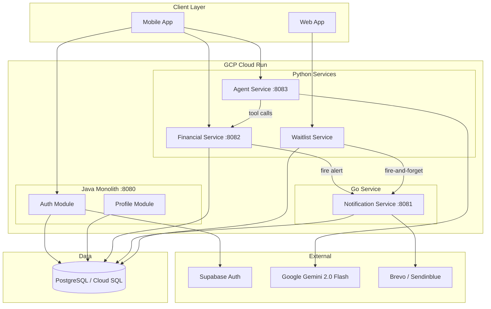
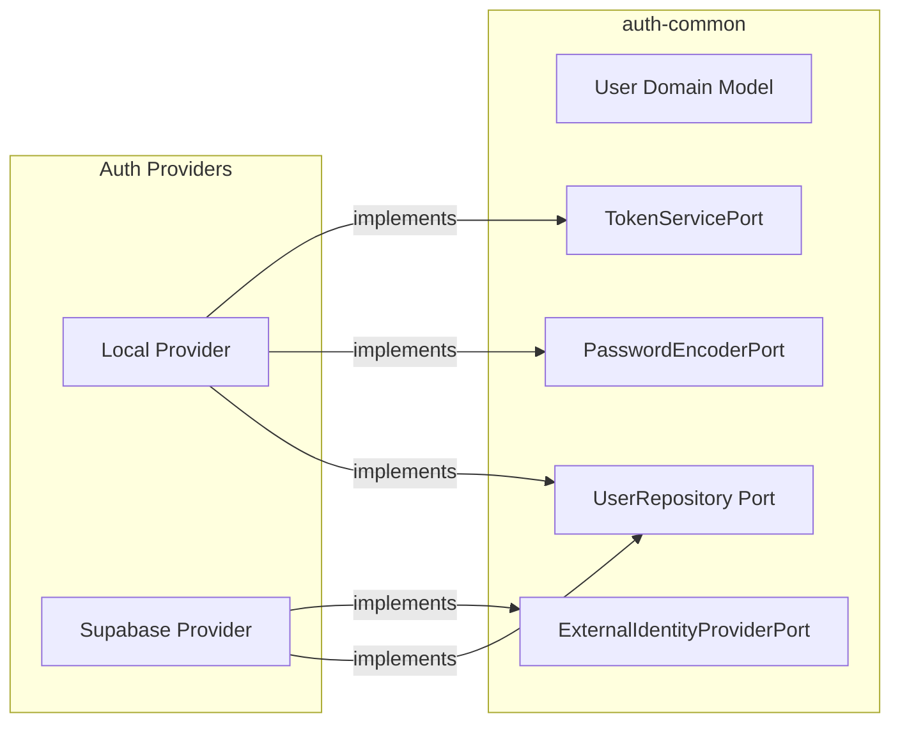
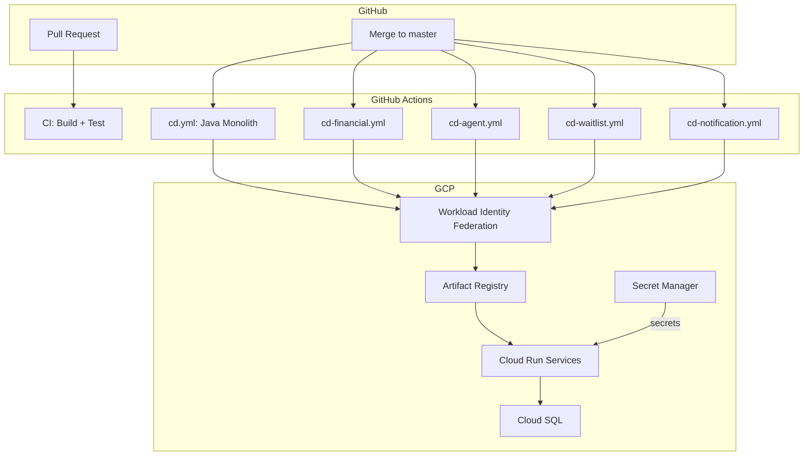
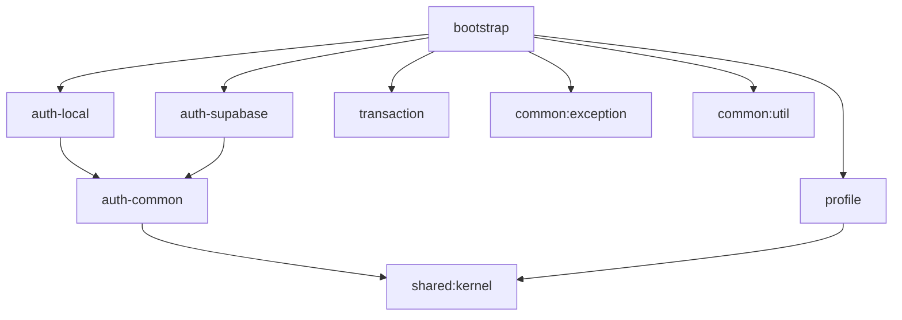
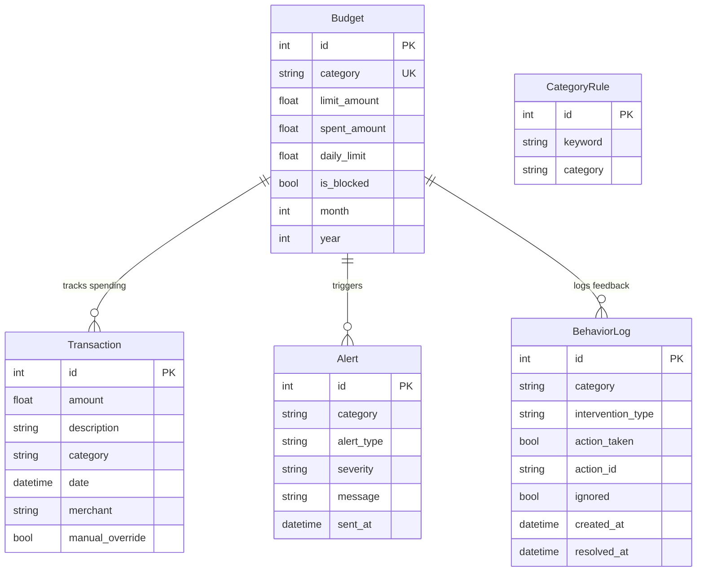
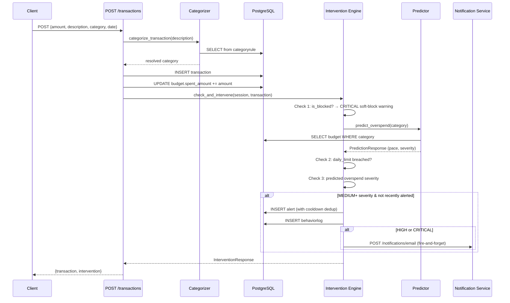
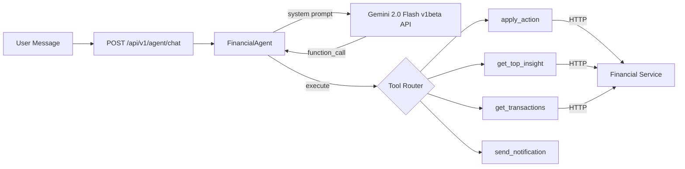
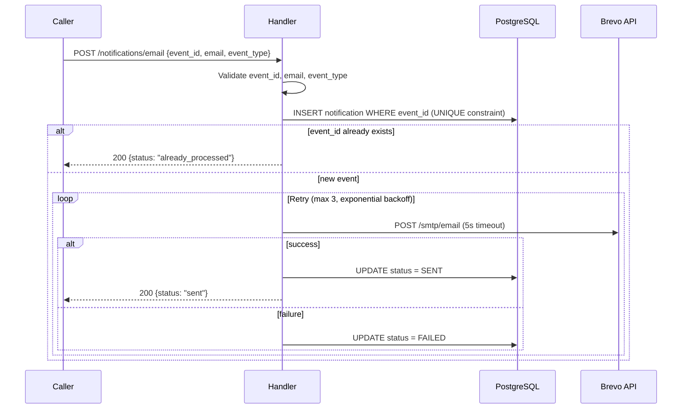

# MoneyLane — High Level Design & Low Level Design

**Scanned**: 2026-03-22 &nbsp;|&nbsp; **Repository**: `elevenxstudios`

---

## Part 1: High Level Design (HLD)

### 1.1 System Vision

MoneyLane is a **Proactive Financial Co-pilot** — it transforms passive expense tracking into AI-driven, real-time behavioral interventions. The core thesis: *don't just show users what they spent, **change how they spend***.

### 1.2 Architecture Style

```
┌──────────────────────────────────────────────────────────────────────┐
│                          MONOREPO                                    │
│                                                                      │
│  ┌──────────────────┐    ┌────────────────────────────────────────┐  │
│  │  MODULAR MONOLITH │    │       STANDALONE MICROSERVICES         │  │
│  │  (Java/Spring)    │    │  (Python FastAPI · Go net/http)        │  │
│  │                   │    │                                        │  │
│  │  Auth · Profile   │    │  Financial · Agent · Notification ·   │  │
│  │  Transaction*     │    │  Waitlist                              │  │
│  └──────────────────┘    └────────────────────────────────────────┘  │
│                                                                      │
│  ┌─────────────────────────────────────────────────────────────────┐ │
│  │  SHARED INFRASTRUCTURE: PostgreSQL · Cloud Run · GCP · CI/CD   │ │
│  └─────────────────────────────────────────────────────────────────┘ │
└──────────────────────────────────────────────────────────────────────┘
```

The system uses a **polyglot monorepo** approach:
- **Java 21 / Spring Boot 3.3** — Identity, profile, and future core domain modules (hexagonal architecture)
- **Python 3.11-3.12 / FastAPI** — Financial engine and AI agent (rapid iteration)
- **Go 1.22** — High-performance notification delivery

### 1.3 High-Level Service Topology



### 1.4 Service Responsibilities

| Service | Tech | Role | Port |
|---------|------|------|------|
| **Java Monolith** | Java 21 / Spring Boot | Identity (Auth + Supabase) & Profile management | 8080 |
| **Financial Service** | Python / FastAPI / SQLModel | Core data engine: transactions, budgets, insight engine, **intervention engine**, predictions | 8082 |
| **Agent Service** | Python / FastAPI / Gemini | AI co-pilot: conversational interface with tool-calling for autonomous actions | 8083 |
| **Notification Service** | Go / net/http / Brevo | Exactly-once transactional email delivery with idempotency | 8081 |
| **Waitlist Service** | Python / FastAPI / SQLAlchemy | Pre-launch email collection, self-service | — |

### 1.5 Data Architecture

All services share a **single Cloud SQL PostgreSQL instance**, isolated by table/schema:

| Schema Owner | Tables | Migration Tool |
|-------------|--------|---------------|
| Java Monolith | `users`, `user_profiles` | Flyway (V2–V5) |
| Financial Service | `transaction`, `budget`, `categoryrule`, `alert`, `behaviorlog` | SQLModel `create_all()` |
| Notification Service | `notifications` | Raw SQL migration |
| Waitlist Service | `waitlist_entries` | Alembic |

### 1.6 Communication Patterns

| From → To | Protocol | Pattern |
|-----------|----------|---------|
| Agent → Financial | HTTP REST | Synchronous tool calls (get data, execute actions) |
| Financial → Notification | HTTP REST | Fire-and-forget on HIGH/CRITICAL alerts |
| Waitlist → Notification | HTTP REST | Fire-and-forget on new signup |
| Client → Java Monolith | HTTP REST + JWT | Auth-protected |
| Java Monolith → Supabase | HTTP REST | External identity provider |
| Agent → Gemini | HTTP REST | LLM inference (v1beta API) |
| Notification → Brevo | HTTP REST | Transactional email send |

### 1.7 Authentication Architecture



Two auth paths exist:
1. **Local (auth-local)**: Register → BCrypt hash → store in `users` → issue JWT (access + refresh)
2. **Supabase (auth-supabase)**: Forward to Supabase API → validate returned JWT with project secrets → sync user record locally

### 1.8 Deployment Architecture



- **Auth**: OIDC via Workload Identity Federation (no static credentials)
- **Tagging**: Immutable `git SHA` image tags
- **Secrets**: `DB_PASSWORD`, `DATABASE_URL`, `BREVO_API_KEY` via GCP Secret Manager
- **Health Gate**: Retry-based `/health` or `/actuator/health` verification post-deploy

---

## Part 2: Low Level Design (LLD)

### 2.1 Java Monolith — Hexagonal Architecture Detail

#### Module Dependency Graph



---

#### auth-common (Shared Domain & Ports)

| Layer | File | Description |
|-------|------|-------------|
| Domain | [User.java](file:///Users/kaushikyelne/Documents/MyProjects/elevenxstudios/modules/auth/auth-common/domain/src/main/java/com/moneylane/modules/auth/common/domain/User.java) | Immutable domain entity with `UserId`, `email`, `passwordHash`, `status`, `externalProvider`, `externalUserId` |
| Application | [UserRepository](file:///Users/kaushikyelne/Documents/MyProjects/elevenxstudios/modules/auth/auth-common/application/src/main/java/com/moneylane/modules/auth/common/application/port/out/UserRepository.java) | Outbound port for user persistence |
| Application | [TokenServicePort](file:///Users/kaushikyelne/Documents/MyProjects/elevenxstudios/modules/auth/auth-common/application/src/main/java/com/moneylane/modules/auth/common/application/port/out/TokenServicePort.java) | Token generation/validation contract |
| Application | [PasswordEncoderPort](file:///Users/kaushikyelne/Documents/MyProjects/elevenxstudios/modules/auth/auth-common/application/src/main/java/com/moneylane/modules/auth/common/application/port/out/PasswordEncoderPort.java) | Password hashing contract |
| Application | [ExternalIdentityProviderPort](file:///Users/kaushikyelne/Documents/MyProjects/elevenxstudios/modules/auth/auth-common/application/src/main/java/com/moneylane/modules/auth/common/application/port/out/ExternalIdentityProviderPort.java) | External auth provider contract |
| Application | [ExternalUserContext](file:///Users/kaushikyelne/Documents/MyProjects/elevenxstudios/modules/auth/auth-common/application/src/main/java/com/moneylane/modules/auth/common/application/port/out/ExternalUserContext.java) | External user identity DTO |
| Application | [ExternalAuthenticationResult](file:///Users/kaushikyelne/Documents/MyProjects/elevenxstudios/modules/auth/auth-common/application/src/main/java/com/moneylane/modules/auth/common/application/port/out/ExternalAuthenticationResult.java) | External auth result DTO |

---

#### auth-local (Native Auth with JWT)

**Inbound Ports:**
| Port | Description |
|------|-------------|
| `RegisterUserUseCase` | Register new user with email + password |
| `AuthenticateUserUseCase` | Login with email + password, returns tokens |

**Service:** `AuthService` — orchestrates registration, login, and token refresh

**Infrastructure Adapters:**

| Adapter | Implements | Details |
|---------|-----------|---------|
| [JwtTokenServiceAdapter](file:///Users/kaushikyelne/Documents/MyProjects/elevenxstudios/modules/auth/auth-local/infrastructure/src/main/java/com/moneylane/modules/auth/local/infrastructure/security/JwtTokenServiceAdapter.java) | `TokenServicePort` | HMAC-SHA signing, configurable expiration (access: 1h, refresh: 24h) |
| `BCryptPasswordEncoderAdapter` | `PasswordEncoderPort` | Spring Security BCrypt |
| `JpaUserRepository` | `UserRepository` | JPA + `SpringDataUserRepository` |
| `JwtAuthenticationFilter` | — | OncePerRequestFilter for stateless JWT validation |
| `SecurityConfig` | — | Spring Security config: stateless sessions, public/protected paths |

**API:** `AuthController` — `POST /api/v1/auth/local/register`, `/login`, `/refresh`

**Migrations:** `V2__create_users_table` → `V3__remove_role_column` → `V4__add_external_auth_fields`

---

#### auth-supabase (External Auth)

**Inbound Ports:** `LoginSupabaseUserUseCase`, `SyncSupabaseUserUseCase`

**Service:** `SupabaseAuthService` — delegates to Supabase API, syncs user locally

**Infrastructure:** `SupabaseUserApiAdapter` (implements `ExternalIdentityProviderPort`), `SupabaseSecurityConfig`

**API:** `SupabaseAuthController` — `POST /api/v1/auth/login`, `GET /api/v1/auth/me`

---

#### Profile Module

**Domain Model:**

```java
// UserProfile (mutable aggregate)
class UserProfile {
    UserId userId;          // immutable
    String displayName;     // mutable
    String avatarUrl;       // mutable
    ProfilePreferences preferences; // mutable (JSONB: theme, notificationsEnabled)
    LocalDateTime createdAt; // immutable
}
```

**Ports:**

| Type | Port | Methods |
|------|------|---------|
| Inbound | `GetMyProfileUseCase` | `getProfile(UserId)` — lazy-create if missing |
| Inbound | `UpdateMyProfileUseCase` | `updateProfile(UserId, UpdateRequest)` — partial update |
| Outbound | `UserProfilePort` | `findByUserId()`, `save()` |

**Infrastructure:** `JpaUserProfileEntity` → `JpaUserProfileMapper` → `JpaUserProfileAdapter` → `JpaUserProfileRepository` (Spring Data)

**API:** `ProfileController` — `GET /api/v1/profile/me`, `PATCH /api/v1/profile/me`

**Tests:** ✅ `UserProfileTest` (domain), `UserProfileServiceTest` (application)

---

#### Transaction Module (⚠️ Skeleton Only)

Has hexagonal layers (`Transaction` domain, `CreateTransactionUseCase`, `TransactionRepository`, `TransactionService`, `TransactionRepositoryAdapter`, `TransactionController`) but **no migration, no real implementation, no tests**.

> [!NOTE]
> The transaction functionality has **moved** to the Python Financial Service — this Java module is now an unused scaffold.

---

### 2.2 Financial Service — Engine Detail

#### Data Model (SQLModel)



#### Transaction Write Flow (Critical Path)



#### Intervention Engine — 3-Check Pipeline

[intervention.py](file:///Users/kaushikyelne/Documents/MyProjects/elevenxstudios/services/financial-service/app/engine/intervention.py) — `check_and_intervene(session, transaction)`:

| Check | Condition | Severity | Action |
|-------|-----------|----------|--------|
| **1. Soft-block** | `budget.is_blocked == True` | CRITICAL | Immediate warning: "You've frozen {category} spending" |
| **2. Daily limit** | Today's spending in category > `budget.daily_limit` | HIGH | "You've passed your daily ₹X cap" |
| **3. Predictive** | `predict_overspend()` returns overspend > 0 | Varies | Loss-framed: "You'll WASTE ₹X this month" |

**Key behaviors:**
- **24h cooldown** per category+alert_type (prevents notification spam)
- **Loss framing**: "You'll WASTE ₹2,400" not "You'll overspend ₹2,400"
- **1-tap action suggestions**: `set_daily_limit`, `soft_block`, `adjust_budget`
- **Fire to Notification Service** on HIGH/CRITICAL (no LLM in critical path)

#### Predictor — Overspend Forecasting

[predictor.py](file:///Users/kaushikyelne/Documents/MyProjects/elevenxstudios/services/financial-service/app/engine/predictor.py):

```
daily_pace = spent_amount / days_elapsed
predicted_total = daily_pace × days_in_month
predicted_overspend = max(predicted_total - budget_limit, 0)
pace_multiplier = daily_pace / (budget_limit / days_in_month)
```

**Severity thresholds:**

| Severity | Overspend % | Budget Usage % |
|----------|-------------|----------------|
| LOW | < 10% | < 60% |
| MEDIUM | 10–25% | 60–85% |
| HIGH | 25–50% | 85–100% |
| CRITICAL | > 50% | > 100% |

#### Insight Ranking — Actionability-Weighted

[ranking.py](file:///Users/kaushikyelne/Documents/MyProjects/elevenxstudios/services/financial-service/app/engine/ranking.py):

```
Score = (Normalized Impact × 0.6) + (Actionability × 0.4)
```

- **Impact normalization**: ₹ amounts mapped to 0–100 scale (₹200 = 30, ₹1000 = 70, ₹5000 = 100)
- **Actionability scoring**: concrete actions (+20 each, max 40) + confidence (×30) + dynamic prompts (+10 each, max 20) − vague penalty (−15)

#### Insight Detectors

| Detector | File | Logic |
|----------|------|-------|
| **Overspending** | [overspending.py](file:///Users/kaushikyelne/Documents/MyProjects/elevenxstudios/services/financial-service/app/engine/overspending.py) | `spent_amount > limit_amount` per budget category |
| **Waste** | [waste.py](file:///Users/kaushikyelne/Documents/MyProjects/elevenxstudios/services/financial-service/app/engine/waste.py) | Late-night Swiggy orders (after 11 PM, > ₹500) |
| **Behavior** | [behavior.py](file:///Users/kaushikyelne/Documents/MyProjects/elevenxstudios/services/financial-service/app/engine/behavior.py) | Weekday Uber rides after 9 PM (≥3 occurrences) |

#### Action Layer

[actions.py](file:///Users/kaushikyelne/Documents/MyProjects/elevenxstudios/services/financial-service/app/routes/actions.py) — The execution layer that closes the loop:

| Endpoint | Action | Behavior |
|----------|--------|----------|
| `POST /set-daily-limit` | Set daily spending cap | Updates `budget.daily_limit`, logs behavior |
| `POST /soft-block` | Toggle spending freeze | Toggles `budget.is_blocked` (friction, not real block) |
| `POST /adjust-budget` | Change monthly limit | Updates `budget.limit_amount` |
| `POST /feedback` | Record user response | Updates `BehaviorLog` — the feedback loop for learning |

#### API Surface

| Route | Method | Handler | Response |
|-------|--------|---------|----------|
| `/api/v1/transactions/` | GET | `get_transactions` | `List[Transaction]` |
| `/api/v1/transactions/` | POST | `create_transaction` | `TransactionCreateResponse` (tx + intervention) |
| `/api/v1/budgets/` | GET | `get_budgets` | `List[BudgetStatus]` (with color coding) |
| `/api/v1/budgets/` | POST | `create_budget` | `Budget` |
| `/api/v1/insights/home` | GET | `get_home_insight` | Top-ranked `InsightResponse` |
| `/api/v1/insights/predictions` | GET | `get_predictions` | `List[PredictionResponse]` |
| `/api/v1/actions/set-daily-limit` | POST | `set_daily_limit` | `ActionResponse` |
| `/api/v1/actions/soft-block` | POST | `soft_block` | `ActionResponse` |
| `/api/v1/actions/adjust-budget` | POST | `adjust_budget` | `ActionResponse` |
| `/api/v1/actions/feedback` | POST | `record_feedback` | `{status, intervention_id}` |

#### Tests (5 files)

| Test | Purpose |
|------|---------|
| `test_predictor.py` | Overspend prediction logic |
| `test_intervention.py` | Intervention engine pipeline |
| `test_ranking.py` | Insight ranking with DB |
| `test_ranking_pure.py` | Pure ranking logic (no DB) |
| `verify_insight_engine.py` | End-to-end insight engine verification |

---

### 2.3 Agent Service — AI Co-pilot Detail

#### Architecture



#### FinancialAgent Class

[financial_agent.py](file:///Users/kaushikyelne/Documents/MyProjects/elevenxstudios/services/agent-service/app/agents/financial_agent.py):

- Uses **Gemini 2.0 Flash** via direct REST API (v1beta, not SDK)
- **Multi-turn function calling**: Agent sends message → Gemini responds with `function_call` → Agent executes tool → feeds result back → Gemini generates final reply
- Returns `{reply, tool_calls}` with full transparency on what tools were used

#### Tools

| Tool | Function | Target |
|------|----------|--------|
| [apply_action](file:///Users/kaushikyelne/Documents/MyProjects/elevenxstudios/services/agent-service/app/tools/action_tool.py) | Execute `set_daily_limit`, `soft_block`, `adjust_budget` | `POST /api/v1/actions/*` |
| [get_top_insight](file:///Users/kaushikyelne/Documents/MyProjects/elevenxstudios/services/agent-service/app/tools/insight_tool.py) | Fetch top-ranked financial insight | `GET /api/v1/insights/home` |
| [get_transactions](file:///Users/kaushikyelne/Documents/MyProjects/elevenxstudios/services/agent-service/app/tools/transaction_tool.py) | Fetch recent transactions (filterable by category) | `GET /api/v1/transactions/` |
| `send_notification` | Send notification via notification service | `POST /notifications/email` |

#### System Prompt Design

[system.py](file:///Users/kaushikyelne/Documents/MyProjects/elevenxstudios/services/agent-service/app/prompts/system.py) — Core behavioral rules:

1. **Action-first**: Every response ends with a next step
2. **Loss framing**: "You'll WASTE ₹X" not "You'll overspend ₹X"
3. **Autonomous tool use**: When user says "yes" / "do it" → execute immediately via `apply_action`
4. **Concise**: Max 2–3 sentences
5. **Strict scope**: Financial only, no casual conversation

#### Schemas

| Schema | Fields |
|--------|--------|
| `ChatRequest` | `message: str`, `history: List[Dict]` |
| `ChatResponse` | `reply: str`, `tool_calls: List[ToolCall]` |
| `ToolCall` | `tool: str`, `args: Dict`, `result: Any` |

---

### 2.4 Notification Service (Go) — Detail

#### Package Structure

```
services/notification/
├── cmd/server/main.go           # Entry point, DB init, HTTP server
├── internal/
│   ├── domain/models.go         # NotificationEvent, Notification, Status constants
│   ├── email/brevo.go           # REST adapter for Brevo API (no SDK)
│   ├── handler/handler.go       # HTTP handler with validation
│   ├── repository/postgres.go   # PostgreSQL persistence (INSERT-first idempotency)
│   ├── service/service.go       # Core processing logic (3 retries, backoff)
│   └── service/service_test.go  # Unit tests
└── migrations/001_create_notifications.sql
```

#### Exactly-Once Delivery Strategy



#### Domain Model

```go
type NotificationEvent struct {
    EventID   string            // Idempotency key (UUID)
    EventType string            // e.g., "WAITLIST_JOINED"
    Email     string            // Recipient
    Metadata  map[string]string // Template variables
}

type Notification struct {
    ID        uuid.UUID
    EventID   string    // UNIQUE constraint
    Email     string
    EventType string
    Status    string    // PENDING → SENT | FAILED
    CreatedAt time.Time
}
```

---

### 2.5 Waitlist Service (Python) — Detail

| File | Purpose |
|------|---------|
| `main.py` | FastAPI app, CORS, router |
| `config.py` | Environment variables, settings |
| `database.py` | SQLAlchemy async engine + session |
| `models.py` | `WaitlistEntry` SQLAlchemy model |
| `schemas.py` | Pydantic request/response DTOs |
| `routes.py` | `POST /join`, `GET /health`, `GET /count` |
| `service.py` | Business logic (idempotent, case-insensitive dedup) |

**Key behavior:** On new signup → generates unique `event_id` → fires notification to Go service → returns success.

---

### 2.6 Shared & Common Libraries

| Library | Files | Purpose |
|---------|-------|---------|
| `shared:kernel` | `UserId.java`, `EntityId.java` | Core domain primitives shared across Java modules |
| `shared:contracts` | `TransactionRequest.java` | Cross-module communication DTOs |
| `common:exception` | `GlobalExceptionHandler.java` | Centralized REST exception handling |
| `common:util` | `ValidationUtils.java` | Shared validation utilities |

---

### 2.7 Docker Compose — Local Development

```
┌──────────────────────────────────────────────────────────────────┐
│  docker-compose.yml                                              │
│                                                                  │
│  ┌──────────┐  ┌──────────┐  ┌──────────────┐  ┌────────────┐  │
│  │ db       │  │ app      │  │ notification │  │ financial  │  │
│  │ PG:5432  │  │ Java:8080│  │ Go:8081      │  │ Python:8082│  │
│  └──────────┘  └──────────┘  └──────────────┘  └────────────┘  │
│       ▲              │              │                  │         │
│       │         depends_on     depends_on          depends_on    │
│       └──────────────┴──────────────┴──────────────────┘        │
│                                                                  │
│  ┌──────────┐                                                   │
│  │ agent    │  → depends_on: financial                          │
│  │ Py:8083  │  → FINANCIAL_SERVICE_URL=http://financial:8080    │
│  └──────────┘                                                   │
└──────────────────────────────────────────────────────────────────┘
```

---

### 2.8 CI/CD Pipeline Detail

| Workflow | Trigger | Steps | Gate |
|----------|---------|-------|------|
| [ci.yml](file:///Users/kaushikyelne/Documents/MyProjects/elevenxstudios/.github/workflows/ci.yml) | PR to `master`/`develop` | Java: `./gradlew build`; Python: matrix `pytest` | Required to merge |
| [cd.yml](file:///Users/kaushikyelne/Documents/MyProjects/elevenxstudios/.github/workflows/cd.yml) | Push to `master` | WIF auth → Docker build → Artifact Registry → Cloud Run deploy → Health check | `/actuator/health` |
| [cd-financial.yml](file:///Users/kaushikyelne/Documents/MyProjects/elevenxstudios/.github/workflows/cd-financial.yml) | Push to `master` (path: `services/financial-service/**`) | `pytest` → Docker → AR → Cloud Run | `/health` |
| [cd-agent.yml](file:///Users/kaushikyelne/Documents/MyProjects/elevenxstudios/.github/workflows/cd-agent.yml) | Push to `master` (path: `services/agent-service/**`) | Docker → AR → Cloud Run | `/api/v1/agent/health` |
| [cd-waitlist.yml](file:///Users/kaushikyelne/Documents/MyProjects/elevenxstudios/.github/workflows/cd-waitlist.yml) | Push to `master` (path: `services/waitlist/**`) | Docker → AR → Cloud Run | `/api/v1/waitlist/health` |
| [cd-notification.yml](file:///Users/kaushikyelne/Documents/MyProjects/elevenxstudios/.github/workflows/cd-notification.yml) | Push to `master` (path: `services/notification/**`) | Docker → AR → Cloud Run | `/notifications/health` |
| [test-auth.yml](file:///Users/kaushikyelne/Documents/MyProjects/elevenxstudios/.github/workflows/test-auth.yml) | — | Auth-specific tests | — |

---

### 2.9 Module Status Summary

| Component | Status | Files | Tests |
|-----------|--------|-------|-------|
| auth-common | ✅ Done | 7 | — |
| auth-local | ✅ Done | 14 + 3 migrations | — |
| auth-supabase | ✅ Done | 6 | — |
| profile | ✅ Done | 14 + 1 migration | ✅ 2 test files |
| transaction (Java) | ⚠️ Deprecated skeleton | 6 | ❌ |
| budget (Java) | 🔴 Empty shell | 0 | ❌ |
| insight (Java) | 🔴 Empty shell | 0 | ❌ |
| financial-service | ✅ Done | 15 + 4 routes + 6 engine | ✅ 5 test files |
| agent-service | ✅ Done | 14 (agent + 4 tools + prompt) | ❌ |
| notification | ✅ Done | 7 + 1 migration | ✅ 1 test file |
| waitlist | ✅ Done | 8 + 1 migration | ❌ |
