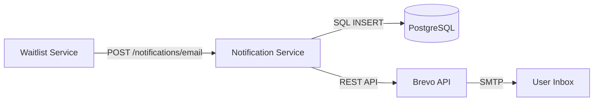

# Notification Service

A high-performance, idempotent email notification microservice built in Go 1.22. It integrates with **Brevo** (Sendinblue) for transactional delivery and uses **PostgreSQL** to guarantee "exactly-once" processing.

---

## 🏗 Architecture



---

## 🚀 Key Features

- **Exactly-Once Delivery**: Uses an "INSERT-first" idempotency strategy with unique `event_id` constraints.
- **Resilient**: 3-attempt retry logic with exponential backoff and 5s request timeouts.
- **Zero SDK**: Custom REST adapter for Brevo using only Go standard library (`net/http`).
- **Cloud Native**: Multi-stage distroless Docker image optimized for GCP Cloud Run.
- **Structured Logging**: JSON logs via `log/slog` including metadata and trace context.

---

## 🚥 Endpoints

| Method | Path | Auth | Description |
|--------|------|------|-------------|
| `POST` | `/notifications/email` | IAM (OIDC) | Send notification (idempotent via `event_id`) |
| `GET` | `/notifications/health` | Public/IAM | Service health check |

### Send Notification API
**Request Body:**
```json
{
  "event_id": "c1f7a08b-...",
  "event_type": "WAITLIST_JOINED",
  "email": "hello@elevenxstudios.com",
  "metadata": {
    "name": "Kaushik"
  }
}
```

**Responses:**
- `200 OK`: `{"status":"sent"}` — Email was successfully handed off to Brevo.
- `200 OK`: `{"status":"already_processed"}` — Request ignored because `event_id` was already handled.
- `500 Error`: `{"status":"failed"}` — Processing failed after all retries.

---

## 🛠 Local Development

### Prerequisites
- Go 1.22+
- PostgreSQL
- Brevo API Key

### Setup
```bash
# 1. Prepare environment
cp .env.example .env

# 2. Start service
# (Ensure DATABASE_URL and BREVO_API_KEY are set in .env)
go run ./cmd/server/

# 3. Running Tests
go test ./internal/service/...
```

---

## 🔧 Infrastructure & Deployment

### Environment Variables
| Variable | Description |
|----------|-------------|
| `DATABASE_URL` | Postgres DSN (Supports Unix sockets for Cloud SQL) |
| `BREVO_API_KEY` | Transactional email API key |
| `FROM_EMAIL` | Authorized sender address (e.g., noreply@elevenxstudios.com) |
| `PORT` | Listening port (Default: 8080) |

### GCP Cloud Run
Deployed automatically via GitHub Actions on push to `master`. 
- **Service Account**: Granted `Secret Manager Secret Accessor` and `Cloud SQL Client`.
- **Identity**: Configured for private internal VPC ingress only (Authorized via OIDC).

---

## 📝 Waitlist Integration
The Waitlist service (Python) triggers this service using a fire-and-forget pattern. It generates a unique `event_id` for every join request to ensure that duplicate signups don't result in duplicate emails.

---
© 2026 ElevenX Studios. Part of the MoneyLane ecosystem.
